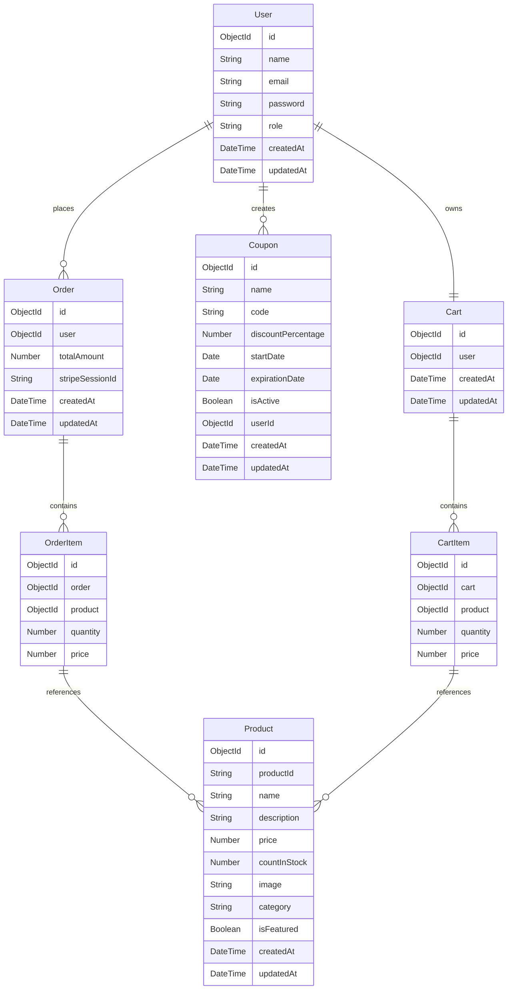

```mermaid
erDiagram
    User {
        ObjectId id
        String name
        String email
        String password
        String role
        DateTime createdAt
        DateTime updatedAt
    }
    Product {
        ObjectId id
        String productId
        String name
        String description
        Number price
        Number countInStock
        String image
        String category
        Boolean isFeatured
        DateTime createdAt
        DateTime updatedAt
    }
    Order {
        ObjectId id
        ObjectId user
        Number totalAmount
        String stripeSessionId
        DateTime createdAt
        DateTime updatedAt
    }
    OrderItem {
        ObjectId id
        ObjectId order
        ObjectId product
        Number quantity
        Number price
    }
    Coupon {
        ObjectId id
        String name
        String code
        Number discountPercentage
        Date startDate
        Date expirationDate
        Boolean isActive
        ObjectId userId
        DateTime createdAt
        DateTime updatedAt
    }
    Cart {
        ObjectId id
        ObjectId user
        DateTime createdAt
        DateTime updatedAt
    }
    CartItem {
        ObjectId id
        ObjectId cart
        ObjectId product
        Number quantity
        Number price
    }

    User ||--o{ Order : places
    Order ||--o{ OrderItem : contains
    OrderItem ||--o{ Product : references
    User ||--o{ Coupon : creates
    User ||--|| Cart : owns
    Cart ||--o{ CartItem : contains
    CartItem ||--o{ Product : references
```
